# Chungo Intelligence Agency - gmtime.eth

Please go Chungo the worlds across spacetime! Enjoy!

### ITHIDH AN CHUNGO AS LUGHA A 'BHIAST AS MOTHA

THE SMALLEST CHUNGO EAT THE BIGGEST BEAST (Scottish Gaelic)

Aug 13 2023

<kbd></kbd>

 

### ZACHTE HEELMEESTERS MAKEN STINKENDE PAYPAL

SOFT HEALERS MAKE STINKING PAYPAL (Dutch)

Jul 28 2023

<kbd></kbd>

 

### JETZT HABEN WIR DEN CHUNGOSALAT

NOW WE HAVE THE CHUNGO SALAD (German)

Jul 20 2023

<kbd></kbd>

 

### NU KOMT DE XRP UIT DE MOUW

NOW THE XRP IS COMING OUT OF THE SLEEVE (Dutch)

Jul 14 2023

<kbd></kbd>

 

### WIE ZIJN CHUNGO BRANDT, MOET OP DE BLAREN ZITTEN

WHOEVER BURNS HIS CHUNGO MUST SIT ON THE BLISTERS (Dutch)

Jul 13 2023

<kbd></kbd>

 

### MET ZIJN NEUS IN DE CHUNGO VALLEN

FALL WITH HIS NOSE INTO THE CHUNGO (Dutch)

Jul 12 2023

<kbd></kbd>

 

### MET ZIJN CHUNGO IN DE BOTER VALLEN

FALLING IN THE BUTTER WITH HIS CHUNGO (Dutch)

Jul 12 2023

<kbd>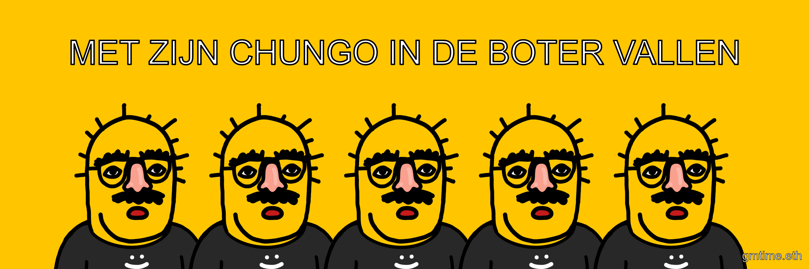</kbd>

 

### WE ZULLEN ZE EENS EEN CHUNGO LATEN RUIKEN!

WE'LL LET THEM SMELL A CHUNGO! (Dutch)

Jul 12 2023

<kbd></kbd>

 

### VOU TIRAR MEU CAVALINHO DA CHUNGO

I'M GOING TO TAKE MY HORSE OUT OF CHUNGO (Portuguese)

Jul 8 2023

<kbd></kbd>

 

### ¡SE FORMÓ TREMENDO ARROZ CON CHUNGO!

TREMENDOUS RICE WAS FORMED WITH CHUNGO! (Spanish)

Jul 8 2023

<kbd></kbd>

 

### ATT GLIDA CHUNGO IN PÅ EN RÄKMACKA

SLIDING CHUNGO INTO A SHRIMP SANDWICH (Swedish)

Jul 6 2023

<kbd>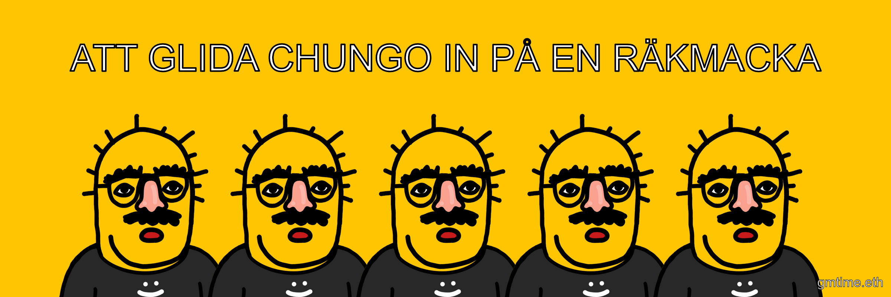</kbd>

 

### NIE MÓJ MAŁP. NIE MOJE CHUNGOS

NOT MY MONKEY. NOT MY CHUNGOS (Polish)

Jul 6 2023

<kbd></kbd>

 

### DET ER UGLE CHUNGOS I MOSEN

THERE ARE OWL CHUNGOS IN THE MARSH (Norwegian)

Jul 6 2023

<kbd>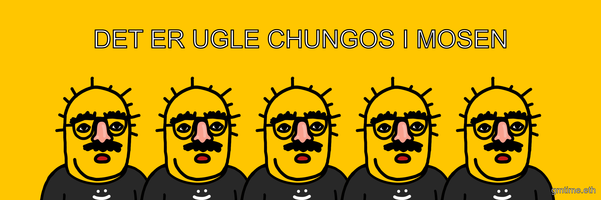</kbd>

 

### IETS VOOR EEN CHUNGO EN EEN EI KOPEN

BUY SOMETHING FOR A CHUNGO AND AN EGG (Dutch)

Jul 5 2023

<kbd></kbd>

 

### SŁOŃ NASTĄPIŁ CI NA CHUNGO?

ELEPHANT STEPPED ON YOUR CHUNGO? (Polish)

Jul 5 2023

<kbd></kbd>

 

### QUEM NÃO TEM CÃO CAÇA COM CHUNGO

WHO DOESN'T HAVE A DOG HUNTS WITH CHUNGO (Portuguese)

Jul 5 2023

<kbd>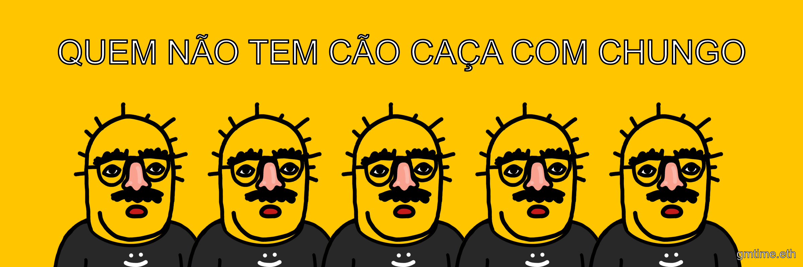</kbd>

 

### J’AI D’AUTRES CHUNGOS À FOUETTER

I HAVE OTHER CHUNGOS TO WHIP (French)

Jul 5 2023

<kbd></kbd>

 

### AVOIR LES CHUNGOS ENTRE DEUX CHAISES

HAVE THE CHUNGOS BETWEEN TWO CHAIRS (French)

Jul 5 2023

<kbd>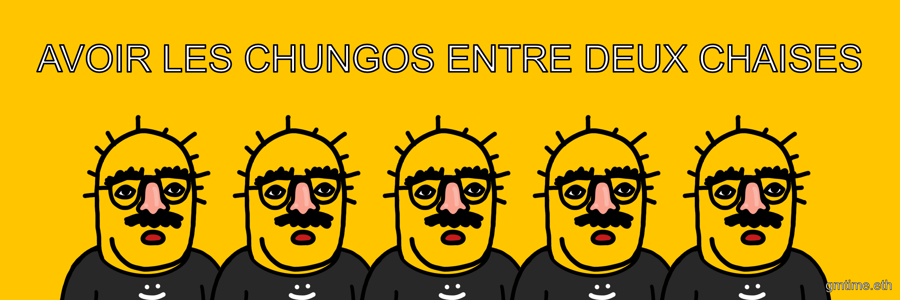</kbd>

 

### ALSOF ER EEN ENGELTJE OVER JE CHUNGO PIEST

LIKE AN ANGEL PEES ON YOUR CHUNGO (Dutch)

Jul 5 2023

<kbd></kbd>

 

### NIE MÓJ CYRK. NIE MOJE CHUNGO

NOT MY CIRCUS. NOT MY CHUNGO (Polish)

Jun 29 2023

<kbd></kbd>

 

### LES CHUNGOS SONT CUITES

THE CHUNGOS ARE COOKED (French)

Jun 29 2023

<kbd></kbd>

 

### TENHO MACAQUINHOS NA CHUNGO CABEÇA

I HAVE MONKEYS ON MY CHUNGO HEAD (Portuguese)

Jun 29 2023

<kbd></kbd>

 

### TIRAR MEU CHUNGO DA CHUVA

GET MY CHUNGO OUT OF THE RAIN (Portuguese)

Jun 29 2023

<kbd></kbd>

 

### ECH HUNN DE CHUNGO

I HAVE THE CHUNGO (Luxembourgish)

Jun 24 2023

<kbd></kbd>

 

### BENYEN SAN KACHE CHUNGO

BATHING WITHOUT HIDING CHUNGO (Haitian Creole)

Jun 24 2023

<kbd>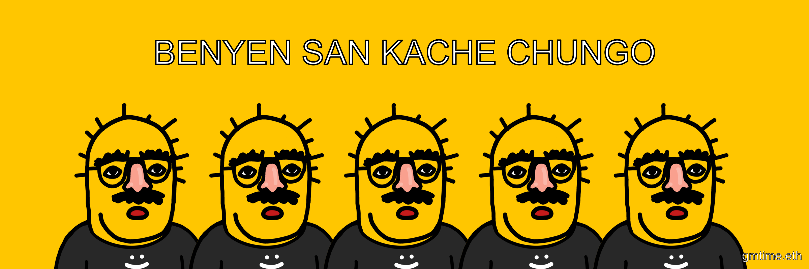</kbd>

 

### NOU PA MANJE LAJAN CHUNGO, NOU PA MANJE MANJE BLIYE

WE DON'T EAT CHUNGO MONEY, WE DON'T EAT FORGOTTEN FOOD (Haitian Creole)

Jun 24 2023

<kbd></kbd>

 

### NÚ DUGA CHUNGO VETTLINGATÖK

CHUNGO MITTENS ARE ENOUGH NOW (Icelandic)

Jun 24 2023

<kbd></kbd>

 

### ÉG KEM ALVEG AF CHUNGO

I COMPLETELY COME FROM CHUNGO (Icelandic)

Jun 24 2023

<kbd></kbd>

 

### KEMUR ALLT MEÐ KALDA CHUNGO

EVERYTHING COMES WITH COLD CHUNGO (Icelandic)

Jun 24 2023

<kbd></kbd>

 

### LLON LLYGOD LLE NI BO CHUNGO

HAPPY MICE WHERE WE DON'T CHUNGO (Welsh)

Jun 22 2023

<kbd>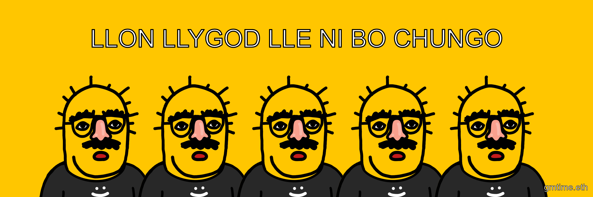</kbd>

 

### CYNT Y CYFERFYDD DAU CHUNGOS NA DAU FYNYDD

EARLIER THE MEETING OF TWO CHUNGOS THAN TWO MOUNTAINS (Welsh)

Jun 22 2023

<kbd>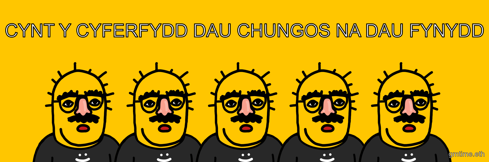</kbd>

 

### CHUNGOS O'R UNLLIW, EHEDANT I'R UNLLE

CHUNGOS OF THE SAME COLOR, THEY FLY TO THE SAME PLACE (Welsh)

Jun 22 2023

<kbd>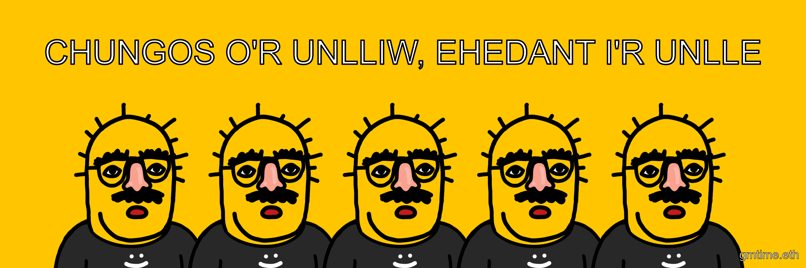</kbd>

 

### TUIG THUS’ AN CHUNGO, 'S TUIGIDH AN CHUNGO THU

YOU UNDERSTAND THE CHUNGO, AND THE CHUNGO UNDERSTANDS YOU (Scottish Gaelic)

Jun 22 2023

<kbd></kbd>

 

### INNSIDH NA CHUNGO AS T-FHOGHAR E

THE CHUNGO WILL TELL IT IN THE FALL (Scottish Gaelic)

Jun 22 2023

<kbd>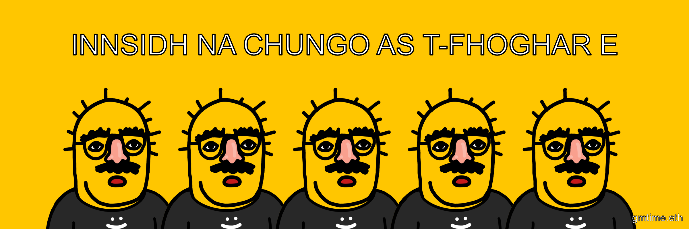</kbd>

 

### COINNICHIDH NA CHUNGO FAR NACH COINNICH NA CNUIC

THE CHUNGOS WILL MEET WHERE THE HILLS DO NOT MEET (Scottish Gaelic)

Jun 22 2023

<kbd>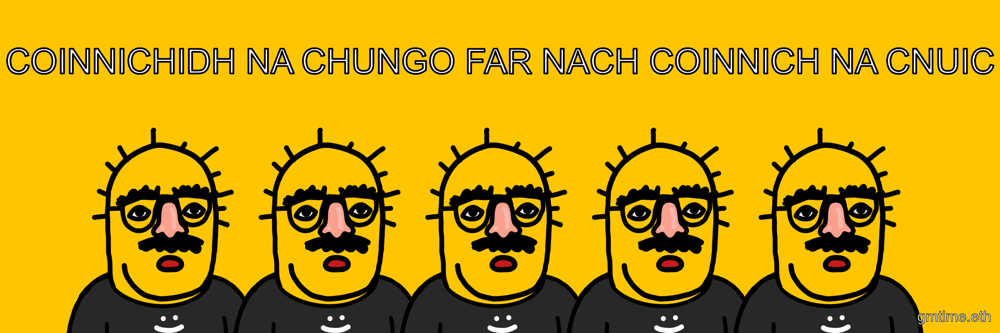</kbd>

 

### A' BHIAST AS MUTHA AG ITHE NA CHUNGO AS LUGHA

THE BIGGEST BEAST EAT THE SMALLEST CHUNGO (Scottish Gaelic)

Jun 22 2023

<kbd>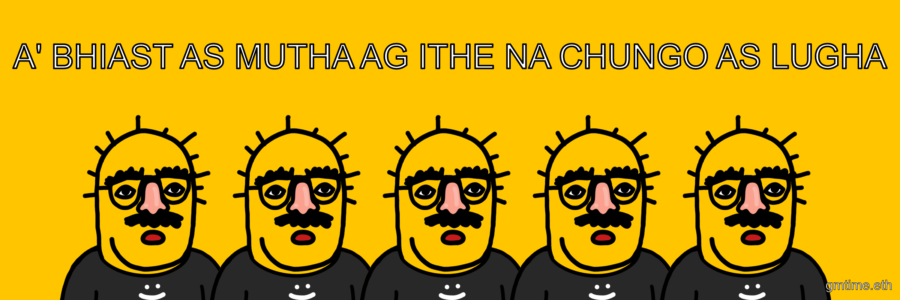</kbd>

 

### CREERSE LA ÚLTIMA CHUNGO EN EL DESIERTO

BELIEVING THE LAST CHUNGO IN THE DESERT (Spanish)

Jun 21 2023

<kbd></kbd>

 

### EL MISMO PERRO CON DIFERENTE CHUNGO

THE SAME DOG WITH DIFFERENT CHUNGO (Spanish)

Jun 21 2023

<kbd></kbd>
 

### MONI CHUNGO PÄÄLTÄ KAUNIS

MANY CHUNGOS ARE BEAUTIFUL ON THE OUTSIDE (Finnish)

Jun 21 2023

<kbd></kbd>

 

### SATAA KUIN CHUNGO PERSEESTÄ

RAINING LIKE CHUNGO'S ASS (Finnish)

Jun 21 2023

<kbd></kbd>

 

### ZACHTE HEELMEESTERS MAKEN STINKENDE CHUNGO

SOFT HEALERS MAKE STINKING CHUNGO (Dutch)

Jun 21 2023

<kbd></kbd>

 

### LANGE CHUNGO HEBBEN

HAVE LONG CHUNGO (Dutch)

Jun 21 2023

<kbd></kbd>

 

### NU KOMT DE CHUNGO UIT DE MOUW

NOW THE CHUNGO COMES OUT OF THE SLEEVE (Dutch)

Jun 20 2023

<kbd></kbd>

 

### DE CHUNGO IN DE POT VINDEN

FINDING THE CHUNGO IN THE JAR (Dutch)

Jun 20 2023

<kbd></kbd>

 

### UM DEN HEISSEN CHUNGO HERUMREDEN

TALKING ABOUT THE HOT CHUNGO (German)

Jun 20 2023

<kbd></kbd>

 

### DIE BELEIDIGTE CHUNGO SPIELEN

PLAY THE OFFENDED CHUNGO (German)

Jun 20 2023

<kbd></kbd>

 

### SICH ZUM CHUNGO MACHEN

MAKE YOURSELF CHUNGO (German)

Jun 20 2023

<kbd></kbd>

 

### KLEINVIEH MACHT AUCH CHUNGO

SMALL FARMS ALSO DO CHUNGO (German)

Jun 20 2023

<kbd></kbd>

 

### MIT IHM KANN MAN CHUNGO STEHLEN

YOU CAN STEAL CHUNGO WITH IT (German)

Jun 20 2023

<kbd></kbd>

 

### ICH VERSTEHE NUR CHUNGOHOF

I ONLY UNDERSTAND CHUNGHOF (German)

Jun 20 2023

<kbd></kbd>

 

### SIE HAT EINEN CHUNGO

SHE HAS A CHUNGO (German)

Jun 20 2023

<kbd></kbd>

 

### DAS IST MIR CHUNGO

THIS IS ME CHUNGO (German)

Jun 20 2023

<kbd></kbd>

 

### KEIN CHUNGO WAR DA

NO CHUNGO WAS THERE (German)

Jun 20 2023

<kbd></kbd>

 

### DA LIEGT DER CHUNGO BEGRABEN

THIS IS THE BURIED OF THE CHUNGO (German)

Jun 20 2023

<kbd></kbd>

 

### WO FUCHS UND HASE CHUNGO SAGEN

WHERE FOX AND RABBIT SAY CHUNGO (German)

Jun 20 2023

<kbd></kbd>

 

### MEIN CHUNGO IST UNTER ALLER SAU

MY CHUNGO IS UNDER ALL PIG (German)

Jun 20 2023

<kbd></kbd>

 

### DU GEHST MIR AUF DEN CHUNGO

YOU GO ON MY CHUNGO (German)

Jun 20 2023

<kbd></kbd>

 

### DAS LEBEN IST KEIN CHUNGOHOF

LIFE IS NOT A CHUNGO FARM (German)

Jun 20 2023

<kbd></kbd>

 

### LEBEN WIE CHUNGO IN FRANKREICH

LIVE LIKE CHUNGO IN FRANCE (German)

Jun 20 2023

<kbd></kbd>

 

### WAKEY WAKEY HANDS OFF

Apr 17 2023

<kbd></kbd>

 

### GOOD MORNING GOOD MORNING

Apr 17 2023

<kbd></kbd>

 

### Chungos_1384x5-2400x800 Blank

Apr 17 2023

<kbd>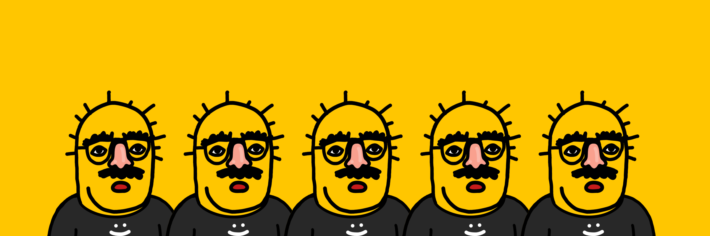</kbd>
